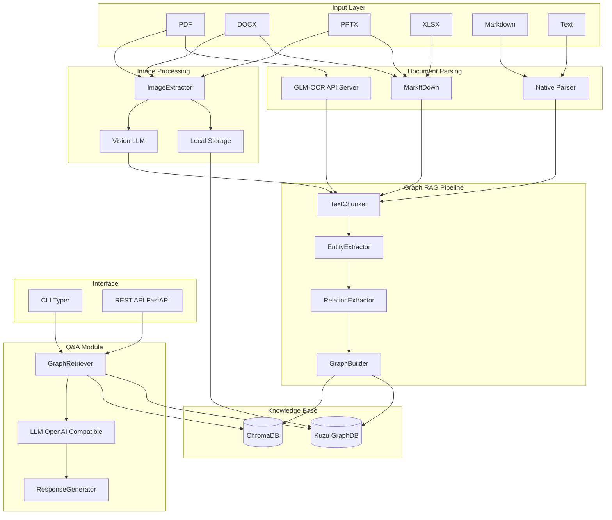

# Document Agent 구현 계획

## 아키텍처 개요



## 프로젝트 구조

```
document_agent/
├── pyproject.toml              # 의존성 관리 (Poetry)
├── README.md
├── .env.example                # 환경변수 템플릿
├── src/
│   └── document_agent/
│       ├── __init__.py
│       ├── config.py           # 설정 관리
│       ├── parsers/            # 문서 파싱 모듈
│       │   ├── __init__.py
│       │   ├── base.py         # BaseParser 추상 클래스
│       │   ├── pdf_parser.py   # GLM-OCR API 클라이언트
│       │   ├── office_parser.py # MarkItDown 래퍼 (DOCX, PPTX, XLSX)
│       │   ├── text_parser.py  # MD, TXT 네이티브 파서
│       │   └── image_processor.py # 이미지 추출 및 Vision LLM 처리
│       ├── graph/              # Graph RAG 모듈
│       │   ├── __init__.py
│       │   ├── chunker.py      # 텍스트 청킹
│       │   ├── entity.py       # 엔티티 추출
│       │   ├── relation.py     # 관계 추출
│       │   └── builder.py      # 그래프 구축
│       ├── storage/            # 저장소 모듈
│       │   ├── __init__.py
│       │   ├── kuzu_store.py   # Kuzu 그래프 DB
│       │   └── vector_store.py # ChromaDB 벡터 저장소
│       ├── qa/                 # 질의응답 모듈
│       │   ├── __init__.py
│       │   ├── retriever.py    # 하이브리드 검색
│       │   └── generator.py    # LLM 응답 생성
│       ├── llm/                # LLM 클라이언트
│       │   ├── __init__.py
│       │   └── client.py       # OpenAI Compatible 클라이언트
│       ├── cli.py              # Typer CLI
│       └── api.py              # FastAPI 서버
├── data/                       # 데이터 저장 디렉토리
│   ├── kuzu_db/               # Kuzu DB 파일
│   ├── chroma_db/             # ChromaDB 파일
│   └── images/                # 추출된 이미지 저장
└── tests/
    └── ...
```

## 핵심 구현 사항

### 1. 문서 파싱 모듈

#### PDF 파싱: GLM-OCR (외부 API 서버)

- **GLM-OCR**: 복잡한 문서 이해를 위한 멀티모달 OCR 모델 (0.9B 파라미터)
- 외부 API 서버 연결 (vLLM/SGLang/Ollama로 호스팅)
- OpenAI Compatible API 형식으로 호출
- 지원 프롬프트:
  - `"Text Recognition:"` - 텍스트 추출
  - `"Table Recognition:"` - 테이블 인식
  - `"Formula Recognition:"` - 수식 인식

```python
# GLM-OCR API 호출 예시
class GLMOCRClient:
    def __init__(self, base_url: str):
        self.client = OpenAI(base_url=base_url, api_key="dummy")
    
    def parse_pdf_page(self, image_path: str) -> str:
        response = self.client.chat.completions.create(
            model="glm-ocr",
            messages=[{
                "role": "user",
                "content": [
                    {"type": "image", "url": image_path},
                    {"type": "text", "text": "Text Recognition:"}
                ]
            }],
            max_tokens=8192
        )
        return response.choices[0].message.content
```

#### Office 문서 파싱: MarkItDown

- **Microsoft MarkItDown** 라이브러리 활용
- DOCX, PPTX, XLSX를 Markdown으로 직접 변환
- 문서 구조(헤딩, 리스트, 테이블, 링크) 보존

```python
# MarkItDown 사용 예시
from markitdown import MarkItDown

class OfficeParser:
    def __init__(self):
        self.md = MarkItDown()
    
    def parse(self, file_path: str) -> str:
        result = self.md.convert(file_path)
        return result.text_content
```

#### MD/TXT 파싱

- 네이티브 파이썬으로 직접 읽기

#### 이미지 처리: Vision LLM

문서에 포함된 이미지를 추출하고 Vision LLM으로 설명을 생성합니다.

**이미지 처리 파이프라인:**

1. 문서에서 이미지 추출 (PDF: PyMuPDF, Office: MarkItDown 내장)
2. 이미지를 로컬에 저장 (`data/images/{doc_id}/{image_id}.png`)
3. Vision LLM으로 이미지 설명 생성
4. 이미지 메타데이터를 그래프에 노드로 저장 (파일 경로 + 설명)

**지원 Vision LLM:**

- OpenAI GPT-4o / GPT-4-turbo
- Anthropic Claude 3 (Sonnet/Opus)
- 기타 OpenAI Compatible Vision API

```python
# 이미지 처리 예시
class ImageProcessor:
    def __init__(self, llm_client: OpenAI, model: str = "gpt-4o"):
        self.client = llm_client
        self.model = model
    
    def describe_image(self, image_path: str) -> str:
        """Vision LLM으로 이미지 설명 생성"""
        with open(image_path, "rb") as f:
            image_data = base64.b64encode(f.read()).decode()
        
        response = self.client.chat.completions.create(
            model=self.model,
            messages=[{
                "role": "user",
                "content": [
                    {"type": "image_url", "image_url": {"url": f"data:image/png;base64,{image_data}"}},
                    {"type": "text", "text": "이 이미지를 상세히 설명해주세요."}
                ]
            }],
            max_tokens=1024
        )
        return response.choices[0].message.content
```

**MarkItDown 이미지 설명 통합:**

MarkItDown은 `llm_client`를 제공하면 자동으로 이미지 설명을 생성합니다:

```python
from markitdown import MarkItDown
from openai import OpenAI

client = OpenAI()
md = MarkItDown(llm_client=client, llm_model="gpt-4o")
result = md.convert("presentation.pptx")  # 이미지 설명 자동 포함
```

### 2. Graph RAG 파이프라인

- **TextChunker**: 문서를 의미 단위로 청킹 (512토큰 기준, 오버랩 50토큰)
- **EntityExtractor**: LLM 기반 엔티티 추출 (인물, 조직, 개념, 날짜 등)
- **RelationExtractor**: 엔티티 간 관계 추출 (subject-predicate-object 트리플)
- **GraphBuilder**: 추출된 엔티티/관계를 Kuzu 그래프로 구축

### 3. 저장소

- **Kuzu**: 엔티티 노드, 이미지 노드, 관계 에지 저장
  - Node 스키마:
    - `Document(id, name, path, type, created_at)`
    - `Chunk(id, content, doc_id, page_num, position)`
    - `Entity(id, name, type, properties)`
    - `Image(id, path, description, doc_id, page_num)`
  - Edge 스키마:
    - `CONTAINS(Document -> Chunk/Image)`
    - `MENTIONS(Chunk -> Entity)`
    - `RELATED_TO(Entity -> Entity, predicate)`
    - `DEPICTS(Image -> Entity)` - 이미지에 등장하는 엔티티
- **ChromaDB**: 청크/이미지 설명 임베딩 저장 (하이브리드 검색용)
- **로컬 파일 시스템**: 이미지 원본 저장 (`data/images/`)

### 4. 질의응답

- **GraphRetriever**: 

  1. 질문에서 키워드/엔티티 추출
  2. 그래프에서 관련 서브그래프 검색 (Cypher 쿼리)
  3. 벡터 유사도로 관련 청크 검색
  4. 컨텍스트 결합

- **ResponseGenerator**: LLM에 컨텍스트와 질문 전달하여 답변 생성

### 5. 인터페이스

**CLI 명령어:**

```bash
# 문서 인덱싱
docagent index ./documents/

# 질문하기
docagent ask "문서에서 주요 내용은?"

# 서버 시작
docagent serve --port 8000
```

**REST API 엔드포인트:**

- `POST /index` - 문서 업로드 및 인덱싱
- `POST /ask` - 질문 및 답변
- `GET /health` - 헬스체크

## 주요 의존성

```toml
[tool.poetry.dependencies]
python = "^3.11"
# 문서 파싱
markitdown = {version = "^0.1", extras = ["all"]}  # DOCX, PPTX, XLSX 파싱
pymupdf = "^1.24"                                   # PDF → 이미지 변환 (GLM-OCR용)
httpx = "^0.27"                                     # GLM-OCR API 호출
# Graph RAG
kuzu = "^0.4"
chromadb = "^0.4"
# LLM
openai = "^1.0"
tiktoken = "^0.7"
# 인터페이스
typer = "^0.12"
fastapi = "^0.111"
uvicorn = "^0.30"
pydantic = "^2.0"
pydantic-settings = "^2.0"
python-multipart = "^0.0.9"
```

## GLM-OCR 서버 설정 가이드

GLM-OCR를 외부 API 서버로 사용하려면 다음 중 하나의 방법으로 서빙해야 합니다:

**Option 1: vLLM (권장)**

```bash
pip install -U vllm
vllm serve zai-org/GLM-OCR --port 8080
```

**Option 2: SGLang**

```bash
pip install sglang
python -m sglang.launch_server --model zai-org/GLM-OCR --port 8080
```

**Option 3: Ollama**

```bash
ollama run glm-ocr
```

서버가 실행되면 `.env`에 엔드포인트를 설정합니다:

```bash
# GLM-OCR 설정 (PDF OCR)
GLM_OCR_BASE_URL=http://localhost:8080/v1

# LLM 설정 (질의응답 + 엔티티 추출)
LLM_BASE_URL=https://api.openai.com/v1
LLM_API_KEY=sk-xxx
LLM_MODEL=gpt-4o

# Vision LLM 설정 (이미지 설명 생성)
VISION_LLM_MODEL=gpt-4o  # 또는 claude-3-sonnet-20240229

# 임베딩 설정
EMBEDDING_MODEL=text-embedding-3-small
```
